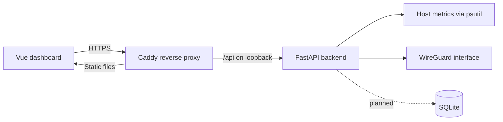

# WireGuard VPN Dashboard

A self-hosted web dashboard for monitoring a WireGuard VPN server, its peers, and the status of the Ubuntu host running it.

> [!NOTE]
> This project is under active development. The monitoring interface works, while authentication, device provisioning, and safe privileged WireGuard management are still being built. 

## What it does

- Displays server uptime, CPU usage, memory usage, and disk usage.
- Reads active WireGuard peer information from the local server.
- Shows peer endpoints, tunnel addresses, latest handshakes, and transfer totals.
- Refreshes the active dashboard view automatically.
- Includes an initial SQLite schema for users, sessions, devices, and audit events.
- Supports deployment behind Caddy, keeping the FastAPI service on loopback.

## Project status

| Area | Status |
| --- | --- |
| Server health dashboard | Working prototype |
| WireGuard peer monitoring | Working prototype |
| HTTPS deployment through Caddy | Documented and tested |
| Database schema | Initial migration |
| Application authentication | Planned |
| Device creation and revocation | Planned |
| Restricted privilege helper | Planned |

## Architecture



The frontend uses a relative `/api` URL in deployment. Caddy serves the compiled Vue application and forwards API requests to FastAPI on `127.0.0.1:8000`. WireGuard and HTTPS can share port `443` because WireGuard uses UDP while HTTPS uses TCP.

## Technology

- **Frontend:** Vue 3 and Vite
- **Backend:** Python, FastAPI, Uvicorn, and psutil
- **Persistence:** SQLite
- **VPN:** WireGuard
- **Deployment:** Ubuntu, systemd, and Caddy

## Repository layout

```text
wg-dashboard/
├── backend/
│   ├── api.py                  # FastAPI endpoints
│   ├── database.py             # SQLite access helpers
│   ├── migrations/001_initial.sql
│   └── requirements.txt
├── frontend/
│   ├── src/App.vue             # Dashboard interface
│   ├── src/main.js
│   └── package.json
└── docs/
    ├── deployment-progress.md
    ├── systemd-service.md
    └── wireguard-setup.md
```

## Local setup

### 1. Backend

From the repository root:

```bash
python3 -m venv .venv
source .venv/bin/activate
python -m pip install -r backend/requirements.txt
uvicorn backend.api:app --host 127.0.0.1 --port 8000 --reload
```

The API is then available at `http://127.0.0.1:8000`, with interactive documentation at `http://127.0.0.1:8000/docs`.

### 2. Frontend

In another terminal:

```bash
cd frontend
npm ci
npm run dev
```

The deployed frontend expects requests under `/api`. Local frontend development therefore requires a reverse proxy from `/api` to `http://127.0.0.1:8000`, matching the production Caddy arrangement.

### 3. Production build

```bash
cd frontend
npm run build
```

Vite writes the production assets to `frontend/dist/`.

## Current API

| Method | Endpoint | Description |
| --- | --- | --- |
| `GET` | `/system/info` | Host uptime, CPU, memory, disk, and timestamp |
| `GET` | `/wg/peers` | WireGuard peer and transfer information |

Reading WireGuard state requires elevated operating-system permissions. The current backend command is suitable only for development; production peer access must use a narrowly scoped privileged helper rather than running the application as root or granting unrestricted `sudo` access.

## Deployment guides

- [Deployment progress and architecture](docs/deployment-progress.md)
- [Hardened systemd service](docs/systemd-service.md)
- [WireGuard server setup](docs/wireguard-setup.md)

## Security

This dashboard handles security-sensitive VPN metadata. Before exposing it beyond a trusted development environment:

- Add application authentication and authorization.
- Remove preshared keys from all API responses.
- Replace direct `sudo wg` execution with a restricted helper.
- Run FastAPI as an unprivileged user and bind it only to loopback.
- Place the application behind HTTPS.
- Keep WireGuard private keys, DuckDNS tokens, databases, and environment files out of Git.
- Add audit logging, rate limiting, backup procedures, and automated tests.

If a token or private key is accidentally committed or shared, rotate it immediately; deleting it from the latest revision does not remove it from Git history.

## Roadmap

- [ ] Add secure administrator login and session management.
- [ ] Implement device creation, configuration download, and revocation.
- [ ] Allocate tunnel addresses transactionally while preserving existing peers.
- [ ] Introduce a minimal privileged WireGuard management service.
- [ ] Connect the SQLite schema to the application API.
- [ ] Add loading, empty, and error states to the frontend.
- [ ] Add backend and frontend test suites.
- [ ] Automate atomic deployment, backup, and rollback.

## Contributing

This is currently a personal, early-stage project, but focused issues and pull requests are welcome. Please avoid including real keys, tokens, public endpoints, or production configuration in examples and test fixtures.
